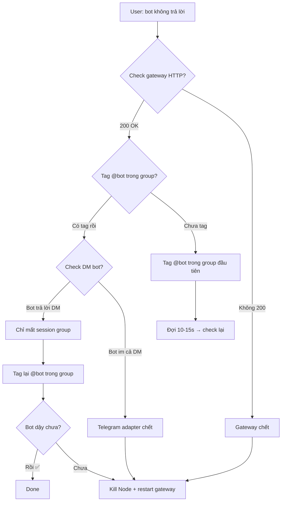
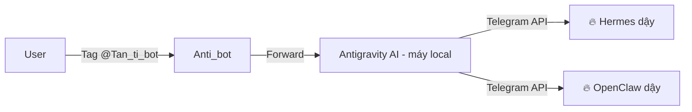

# OpenClaw Ops — Windows Deployment


### Pitfall: `git clone` failures and downloading releases
## Install Paths (Windows)

| Path | Purpose |
|---|---|
| `D:\openclaw` | OpenClaw source / installation root |
| `C:\Users\<user>\.openclaw\` | Config, agents, workspace |
| `C:\Users\<user>\.openclaw\openclaw.json` | Main config (agents, models, plugins, channels) |
| `C:\Users\<user>\.openclaw\agents\main\agent\models.json` | Per-agent model provider definitions |
| `D:\openclaw\.openclaw\workspace\` | Workspace context files |
| `%USERPROFILE%\AppData\Roaming\npm\openclaw.cmd` | CLI entry point (npm global) |

### Pitfall: `git clone` issues and downloading releases
- If `git clone` fails (e.g., due to timeout) or is interrupted, it might leave a non-empty directory, preventing subsequent `git clone` attempts. Always use `rm -rf <directory_name>` to clean up before retrying a clone.
- For large repositories or unstable connections, consider downloading a specific release as a `.zip` or `.tar.gz` archive directly from GitHub's releases page. For a detailed workflow, see [references/downloading-github-releases.md](references/downloading-github-releases.md).


## Gateway Lifecycle

### Install (first time only)
On a fresh Node install, the gateway scheduled task does not exist yet. Install it first:

```powershell
openclaw gateway install
# Output: Installed Scheduled Task: OpenClaw Gateway
# Task script: C:\Users\<user>\.openclaw\gateway.cmd
```

After install, verify the service is registered:
```powershell
openclaw gateway status
# Look for: "Service: Scheduled Task (registered)"
```

### Quick Start (when gateway is "ngủ" or Telegram bot không trả lời)

⚠️ **Không chỉ dùng `openclaw gateway start` — cần kill Node trước.** Nếu không, process cũ vẫn chạy và Telegram adapter không được khởi tạo lại.

#### 📌 Phương pháp 1: `openclaw dashboard --yes` (Recommended — phiên bản 2026.6.5+)

Cách này đơn giản nhất, tự động kill + restart gateway + mở dashboard:

```powershell
# 1. Kill ALL Node processes trước (bắt buộc)
# ⚠️ taskkill từ Git Bash thường FAIL — dùng PowerShell
powershell.exe -Command "Get-Process node -ErrorAction SilentlyContinue | Stop-Process -Force"

# 2. Verify kill thành công
sleep 2
tasklist //fo csv 2>&1 | grep -i node | wc -l
# Expected: 0

# 3. Restart bằng dashboard --yes
openclaw dashboard --yes
# Output: Restarted Scheduled Task: OpenClaw Gateway
#         Dashboard URL: http://127.0.0.1:18789/

# 4. Verify
sleep 5
curl -s -o /dev/null -w "%{http_code}" http://127.0.0.1:18789/
# Expected: 200
```

**⚠️ Lưu ý cú pháp:** Version 2026.6.5 không hỗ trợ `--port` hoặc `--host`. Chạy `openclaw dashboard` không có đối số hoặc `openclaw dashboard --yes`. Port được lấy từ config.

#### 📌 Phương pháp 2: `openclaw gateway start` (truyền thống)

```powershell
# 1. Kill ALL Node processes (ƯU TIÊN PowerShell, không dùng cmd.exe taskkill)
powershell.exe -Command "Get-Process node -ErrorAction SilentlyContinue | Stop-Process -Force"

# 2. Verify kill thành công
tasklist //fo csv 2>&1 | grep -i node | wc -l
# Expected: 0

# 3. Start gateway
openclaw gateway start
# Output: Restarted Scheduled Task: OpenClaw Gateway

# 4. Verify — gateway health + dashboard
sleep 5
curl -s -o /dev/null -w "Port 18789: %{http_code}\\\\n" http://127.0.0.1:18789/
openclaw gateway status | grep -E "Runtime|Connectivity"
# Look for: "Runtime: running" + "Connectivity probe: ok"
```

**Verify Telegram bot hoạt động:** Dù gateway OK, Telegram adapter có thể chưa kết nối. Vào dashboard http://127.0.0.1:18789/ → Instances → kiểm tra có `webchat` + `gateway` instance. Nếu chỉ có `gateway` mà không có Telegram channel instance → cần restart lại.

**Kiểm tra nhanh dashboard instances trong terminal:**
```bash
curl -s http://127.0.0.1:18789/instances 2>&1 | grep -i "telegram\\|instance" | head -10
```

#### 🔴 Pitfall: Bot restart làm mất session group — cần tag lại

**Sau mỗi lần restart gateway, bot mất session context của tất cả group chat.** Dù config `groupAllowFrom` đã có group ID chính xác, bot sẽ không tự động trả lời trong group cho đến khi được **tag (@bot_username) lại trong group đó**.

**Pattern cần nhớ:**
1. Restart gateway xong ✅
2. Vào group chat → tag bot → bắt buộc phải có @mention
3. Sau khi tag, bot mới "nhận ra" group và bắt đầu trả lời bình thường
4. Nếu chỉ nhắn trong group KHÔNG tag → bot sẽ không thấy

**Khi gọi bot từ Hermes:**
```python
# Gửi message vào group với @mention để bot "dậy"
# Dùng send_message() với nội dung có @openclaw_tano_bot
send_message(target="telegram:-1003887635890", message="@openclaw_tano_bot dậy em ơi...")
```

**Trường hợp đặc biệt (screenshot từ session trước):** Bot có thể trả lời trong DM ("Tôi không thấy group Tan Tan trong session") dù có config đúng. Giải pháp: tag bot trong group để nó khởi tạo session mới.

### Start (first time / after kill)
```powershell
openclaw gateway start
# Output: Restarted Scheduled Task: OpenClaw Gateway
```

### Status (verify running)
```powershell
openclaw gateway status
# Look for: "Runtime: running" + "Connectivity probe: ok"
```

### Restart (⚠️ Windows pitfall and workaround)
`openclaw gateway restart` sends SIGUSR1 — a Unix signal that **does not exist on Windows**. It will typically fail with an error like:
```
Gateway restart failed: TypeError [ERR_UNKNOWN_SIGNAL]: Unknown signal: SIGUSR1
```

**Fix (Windows-specific):** Kill any existing Node processes related to OpenClaw manually, then start fresh. This is the **preferred and most reliable method** on Windows.

⚠️ **Pitfall: `taskkill` from Git Bash silently fails.** `cmd.exe /c "taskkill /f /im node.exe"` often prints nothing but leaves processes alive — `tasklist | grep node` still shows them. Use PowerShell instead:

```powershell
# ✅ RELIABLE — kills ALL Node processes (use THIS, not cmd.exe taskkill)
powershell.exe -Command "Get-Process node -ErrorAction SilentlyContinue | Stop-Process -Force"
```

**Verification that kill worked:**
```powershell
tasklist //fo csv 2>&1 | grep -i node | wc -l
# Expected: 0  (no Node processes left)
```

**Then, start the gateway:**
```powershell
openclaw gateway start
```

**Verification after restart:**
```bash
sleep 5 && curl -s -o /dev/null -w "%{http_code}" http://127.0.0.1:18789/
# Expected: 200
openclaw gateway status
# Look for: "Runtime: running" + "Connectivity probe: ok"
```

**Fallback (if PowerShell cmd fails):** Use Task Manager (Ctrl+Shift+Esc) → find `node.exe` processes → End task manually → then `openclaw gateway start`.

### Update
The UI shows an update banner when a newer version exists. Click the banner or:

```powershell
& "$env:USERPROFILE\AppData\Roaming\npm\openclaw.cmd" update --yes --no-restart --timeout 600
```

**Flags explained:**
- `--yes` : skip confirmation prompts
- `--no-restart` : don't restart the gateway after update (avoids Windows SIGUSR1 issue)
- `--timeout 600` : 10-minute timeout for npm download (useful on slow connections)

After update, run doctor to verify:
```powershell
& "$env:USERPROFILE\AppData\Roaming\npm\openclaw.cmd" doctor
```

Then manually kill + restart gateway (see Restart section above).

Note: `openclaw upgrade` is an alias for `openclaw update`.

## Agent Configuration

### Adding a New Custom Agent

To add a new agent like `coder-supreme` as a 1st-class OpenClaw agent, follow these three steps:

#### Step 1: Create directories

```bash
mkdir -p "d:/openclaw/.openclaw/workspaces/<agent-name>"
mkdir -p "C:/Users/<user>/.openclaw/agents/<agent-name>/agent"
```

#### Step 2: Write agent definition file

Create `<agentDir>/<agent-name>.md` with the agent's system prompt. Follow format of existing agents — include role, core principles, expertise areas, and response format rules. See `C:\Users\<user>\.openclaw\agents\coder-supreme\agent\coder-supreme.md` for a production example.

#### Step 3: Register in `agents.list`

Add an entry to `openclaw.json` → `agents.list` matching the format of existing entries:

```json
{
  "id": "coder-supreme",
  "name": "coder-supreme",
  "workspace": "d:\\openclaw\\.openclaw\\workspaces\\coder-supreme",
  "agentDir": "C:\\Users\\Nguyen Ngoc Tan\\.openclaw\\agents\\coder-supreme\\agent",
  "model": "google/gemini-2.5-flash"
}
```

#### Step 4: Restart gateway

OpenClaw watches `openclaw.json` for changes, but adding a new agent requires a full restart for the gateway to pick up the new agent entry. See [Restart section](#restart-windows-pitfall-and-workaround) for the Windows kill+start method.

#### ⚠️ Critical Limitation: Sub-Agent Spawning

**Only `main` agent can spawn sub-agents via `sessions_spawn`.** The restriction is **hard-coded in OpenClaw's gateway source code**. Attempting to spawn a custom agent (e.g. `coder-supreme`) as a sub-agent produces:

```
agentId is not allowed for sessions_spawn (allowed: main)
```

Attempting to change this via `gateway config.patch` fails:

```
gateway config.patch cannot change protected config paths: subagents.allowAgents
```

Even editing `openclaw.json` manually to add `"allowAgents": ["main", "coder-supreme"]` to `agents.defaults.subagents` has no effect — the runtime source code checks a hardcoded list, not the config value.

**✅ The correct approach: register the agent in `agents.list` (makes it a peer agent)**

This IS the fix — when an agent is in `agents.list` with its own `agentDir` and `workspace`, it becomes a **top-level peer agent**, not a sub-agent. Users can message it directly on Telegram (if the bot has multiple agents configured). It's a peer of `main`, no spawning needed.

**Direct message flow (Telegram):**
```
User → @openclaw_bot → routes to registered agent by name/mention → dedicated session
```

**Practical workarounds for running code-type tasks:**

| Workaround | How | When to use |
|---|---|---|
| **Enable `coding-agent` skill on `main`** | Already enabled by default via `skills.entries.coding-agent: enabled: true` in openclaw.json | Best default — `main` already has all MCP servers + skills |
| **Talk to custom agent directly** | Use `main` to set up the task, then user messages the custom agent directly on Telegram | When the task is large enough to warrant a dedicated session |
| **Run Hermes alongside** | Run OpenClaw for core ops + Hermes for code workflows on same machine | When you need full terminal/file execution on the host machine (Hermes bypasses OpenClaw spawning restrictions) |

#### ⚠️ Pitfall: Third-party agent code often has bugs — always review before using

Code produced by coding sub-agents (coder-supreme, etc.) frequently ships with Pydantic v1→v2 migration bugs. Common issues when importing their output into a running project:

| Bug | v1 code (broken in v2) | v2 fix |
|---|---|---|
| **`orm_mode` → `from_attributes`** | `class Config: orm_mode = True` | `class Config: from_attributes = True` |
| **`dict()` → `model_dump()`** | `user_data.dict(exclude_unset=True)` | `user_data.model_dump(exclude_unset=True)` |
| **`regex` → `pattern`** | `Field(..., regex="^[a-z]+$")` | `Field(..., pattern="^[a-z]+$")` |
| **Import loops** | `from database import Base` in models.py | Keep `models.py` importing `Base` from a sibling `database.py` — but ensure `database.py` does NOT import from `models.py` |

**Always run a syntax check before accepting the code:**
```bash
cd <project-dir>
python -c "import main; print('OK')"   # catches import chain & syntax
```

**Reference files for common code review issues:**
- `references/pydantic-v1-v2-migration-bugs.md` — full bug table for Pydantic v1→v2 issues
- `references/pip-install-blocked-workaround.md` — workaround when `pip install` is blocked by system pattern detection

### Agent List (from openclaw.json → agents.list)

| Agent | Model | Initialized? |
|---|---|---|
| main | deepseek-chat | ✅ Always |
| manager | deepseek-chat | ❌ agentDir not created until first run |
| kien | deepseek-chat | ❌ |
| tiep | deepseek-chat | ❌ |
| van_anh | deepseek-chat | ❌ |
| researcher | gemini-2.5-flash | ❌ |

**Key insight:** Agents defined in openclaw.json with `agentDir` paths will NOT have those directories created until they run at least once. Only `main` is bootstrapped automatically.

### Changing Agent Models
Edit `openclaw.json` → `agents.list[]` → `model` field per agent. Supported model IDs:
- `deepseek-chat` (DeepSeek V4)
- `deepseek-reasoner` (DeepSeek R1)
- `gemini-2.5-flash` / `gemini-2.5-pro` (if Google provider configured)
- Ollama models: `qwen2.5:1.5b`, `qwen2.5-coder:7b`

**Restart required** for model changes to take effect — but use the manual kill+start method (see above), NOT `gateway restart`.

### Model Selection Strategy

Different agent roles benefit from different models. General guidance:

| Use Case | Recommended Model | Why |
|---|---|---|
| Booking ops (main, manager, kien, tiep, van_anh) | **deepseek-chat** | Good reasoning, enough context (64K) for booking workflows, no image input needed |
| Research / search / analysis | **gemini-2.5-flash** | 1M context (load many web pages/docs), reads images (screenshots, tables), 45% cheaper ($0.15/$0.60 vs $0.27/$1.10) |
| Deep reasoning (debug, math, multi-step logic) | **deepseek-reasoner** | Superior chain-of-thought, but limited to 64K context — use as one-off, not default |

**Key tradeoff:** DeepSeek R1 is smarter per-turn but context-starved. Gemini Flash has 15x the context window at half the price. For research agents that process multiple sources, Gemini wins in practice despite lower raw intelligence score.

### Provider API Type — Critical Pitfall ⚠️

Each provider in `models.providers` has an `api` field that **must match** what the upstream service supports. The allowed values are:

| Value | Endpoint | Works With |
|---|---|---|
| `"openai-completions"` | `/v1/chat/completions` | DeepSeek, OpenAI, Groq, Together, OpenRouter, any OpenAI-compatible API |
| `"openai-responses"` | `/v1/responses` (new API) | OpenAI only |
| `"openai-codex-responses"` | `/v1/responses` (codex) | OpenAI Codex only |
| `"anthropic-messages"` | `/v1/messages` | Anthropic Claude |
| `"ollama"` | Ollama server | Local models |
| `"google-generative-ai"` | Gemini API | Google Gemini |

**🔴 DeepSeek pitfall:** DeepSeek's API (`https://api.deepseek.com`) is compatible with OpenAI's **chat completions** endpoint but NOT with the newer "responses" API. If you set `"api": "openai-responses"` for DeepSeek, all calls return **404** (`model_not_found`), even though the model name looks correct.

```json
// ❌ WRONG — returns 404
"deepseek": {
  "api": "openai-responses",   // DeepSeek doesn't support /v1/responses
  "apiKey": "...",
  "baseUrl": "https://api.deepseek.com",
  "models": ["deepseek-chat"]
}

// ✅ CORRECT — works
"deepseek": {
  "api": "openai-completions",  // uses /v1/chat/completions
  "apiKey": "...",
  "baseUrl": "https://api.deepseek.com",
  "models": ["deepseek-chat", "deepseek-reasoner"]
}
```

**Symptom log entry:**
```
lane task error: error="FailoverError: 404 status code (no body)"
model_fallback_decision: reason="model_not_found", status=404
```

**Fix:** Change `"api": "openai-responses"` → `"api": "openai-completions"` in the deepseek provider block, then kill + restart gateway. No need to change model names or API keys.

**Note for Ollama:** `"api": "ollama"` with `"baseUrl": "http://localhost:11434"` — no model_name remapping needed; use bare model tags like `"qwen2.5:1.5b"`.

### Default Skills (applied to all agents)
- marketing-core, strategy-core
- ticketing-reply-builder, sr-docs-builder, tkt-rut-gon
- amadeus-commands, timatic-advisor, route-advisor
- coding-agent, gemini

## Workspace Document Structure

Under `D:\openclaw\.openclaw\workspace\`:

| File | Purpose |
|---|---|
| `AGENTS.md` | Executive brain — operating modes, response rules, team logic |
| `PROJECT.md` | Business overview, stack, skills, commands — keep in sync with actual config |
| `USER.md` | User profile, preferences, business context — MUST include all brands |
| `SOUL.md` | Personality, tone, behavior rules |
| `HEARTBEAT.md` | Current priorities and business context |
| `TOOLS.md` | Tool and runtime info |
| `commands/*.md` | Packaged task templates (tkt-rut-gon, make-post, research, etc.) |
| `agents/*.md` | Agent descriptions (researcher, social-poster, ticket-ops) |
| `skills/*/SKILL.md` | Custom skills (superpowers, using-superpowers, hermes-for-win) |

### Maintenance Rules
- **PROJECT.md** must reflect actual model/provider choices — update when models change
- **USER.md** must include ALL business entities (ABTRIP + An Bình for this deployment)
- Always check workspace context files when diagnosing agent behaviour issues

## Telegram Channel Setup

**Two places exist** — but only one matters for DMs:

### 1. Plugin Entry (`plugins.entries.telegram`) ← Optional

```json
"telegram": {
  "config": {}
}
```

Controls whether the agent can USE Telegram (send messages programmatically).
For DM chat this is **not required** — the warning below is cosmetic:

```
plugins.entries.telegram: plugin disabled (bundled (disabled by default)) but config is present
```

### 2. Channel Config (`channels.telegram`) ← Required

```json
"telegram": {
  "botToken": "<TOKEN_FROM_BOTFATHER>",
  "enabled": true,
  "dmPolicy": "open",
  "groupPolicy": "allowlist",
  "allowFrom": ["*"]
}
```

**Note:** If `botToken` is empty string `""`, the channel is treated as disabled regardless of the `enabled` flag.

### Allowed Users

Filter by Telegram user ID via `allowFrom`:
- `["*"]` = allow everyone
- `["762010475", "8010849105"]` = only specific user IDs

User IDs appear in OpenClaw gateway logs when someone messages the bot, or use @userinfobot on Telegram to get them.

### Token Retrieval

If the token is lost, ask @BotFather on Telegram:
```
/token -> select your bot -> copy the token
```

## MCP Server Configuration

OpenClaw supports **MCP servers** natively — defined in `openclaw.json` → `mcp.servers`. These give agents access to external tools and data sources via the Model Context Protocol.

The default setup creates one server:

```json
"mcp": {
  "servers": {
    "workspace-docs": {
      "command": "C:\\\\Program Files\\\\nodejs\\\\node.exe",
      "args": [
        "d:\\\\openclaw\\\\.openclaw\\\\openclaw-workspace-mcp.mjs"
      ],
      "cwd": "d:\\\\openclaw\\\\.openclaw",
      "connectionTimeoutMs": 60000
    }
  }
}
```

**Structure:**
- `key` (`workspace-docs`) = server name referenced by agents
- `command` = Node.js binary or any executable (Python, npx, etc.)
- `args` = arguments passed to command
- `cwd` = working directory for the server process
- `connectionTimeoutMs` = max time to wait for server to initialize

**Adding your own MCP server:**
```json
"my-server": {
  "command": "node",           // or "python", "npx", your binary
  "args": ["path/to/server.mjs"],
  "cwd": "path/to/server/dir",
  "connectionTimeoutMs": 30000
}
```

### ⚠️ MCP Server Load Order — Gateway Restart Required

**MCP servers are NOT hot-reloaded.** When you add/edit a server in `mcp.servers`, the gateway must be **fully restarted** for the new server to be available to agents. Simply editing `openclaw.json` is not enough.

**Verification workflow after adding MCP servers:**

```bash
# 1. List MCP server keys in config
python -c "import json; d=json.load(open(r'C:\Users\Nguyen Ngoc Tan\.openclaw\openclaw.json')); print(list(d.get('mcp',{}).get('servers',{}).keys()))"

# 2. Restart gateway (Windows — use kill+start, NOT 'gateway restart')
curl -s -o /dev/null -w "Port 18789: %{http_code} (pre-restart)\\n" http://127.0.0.1:18789/
# ⚠️ Use PowerShell, NOT cmd.exe taskkill (which silently fails in Git Bash)
powershell.exe -Command "Get-Process node -ErrorAction SilentlyContinue | Stop-Process -Force"
sleep 3
curl -s -o /dev/null -w "Port 18789: %{http_code} (post-kill)\\n" http://127.0.0.1:18789/
openclaw gateway start
sleep 5

# 3. Verify gateway is back
curl -s -o /dev/null -w "%{http_code}" http://127.0.0.1:18789/ && echo " GATEWAY OK"
openclaw gateway status | grep -E "Runtime|gateway|service"

# 4. Common issues:
# - Path escapes: Windows paths with \ need \\ in JSON (e.g. D:\\\\AI Store\\\\).
#   config visible via `openclaw.json`, but JSON itself might have bad escapes.
# - npx first-run: first gateway start after adding npx MCP server downloads packages
#   (30-60s). Set connectionTimeoutMs: 120000 for slow connections.
# - Python MCP servers can fail silently if the script crashes on import.
#   Test the script standalone first: `python path/to/mcp_server.py` should start
#   and wait on stdio (no immediate crash).
```

**Check what's installed:** Read `openclaw.json` → `mcp.servers` keys. Each key is a named MCP tool available to all agents.

## Migrating Skills from Another Agent Platform

When porting skills from **Hermes** (or any agent platform) to OpenClaw, follow this workflow:

### 1. Skill Directory Naming

Hermes uses nested `category/skillname` dirs (e.g., `genai/genai-agent-builder/`). OpenClaw uses flat dir names. Flatten by joining with underscore:

| Hermes path | OpenClaw path |
|---|---|
| `genai/genai-agent-builder/` | `genai_genai-agent-builder/` |
| `social-media/facebook-content-mcp/` | `social-media_facebook-content-mcp/` |
| `tuvi/tuvi-expert/` | `tuvi_tuvi-expert/` |

**Copy command (bash/Git Bash):**
```
SRC="/c/Users/<user>/.hermes/skills"
DST="/d/openclaw/.openclaw/workspace/skills"
cp -r "$SRC/category/skillname" "$DST/category_skillname"
```

### 2. Required: `_meta.json`

Every OpenClaw skill directory MUST have `_meta.json`. Without it the skill won't be recognized.

**⚠️ Critical — Hermes vs OpenClaw format mismatch:**

Skills copied FROM Hermes have WRONG `_meta.json` format. Hermes stores:
```json
{"ownerId": "...", "slug": "...", "version": "1.0.0", "publishedAt": 123456789}
```

But OpenClaw expects:
```json
{
  "dependencies": [],
  "auto_run": false,
  "tokens": { "max_input_tokens": 8000, "max_output_tokens": 4000 },
  "tools": []
}
```

**If Hermes-format `_meta.json` stays → OpenClaw silently ignores the entire skill.** No error, no warning — the skill just doesn't appear.

**Fix after copy:** Regenerate all `_meta.json` files with OpenClaw format. Quick batch fix script:
```python
import os, json
for entry in os.listdir(skills_dir):
    meta = os.path.join(skills_dir, entry, "_meta.json")
    with open(meta) as f: content = f.read()
    if '"dependencies"' in content: continue  # already OC format
    with open(meta, "w") as f:
        json.dump({"dependencies":[],"auto_run":False,
                   "tokens":{"max_input_tokens":8000,"max_output_tokens":4000},
                   "tools":[]}, f, indent=2)
```

### 3. MCP Server Configuration Translation

| Type | OpenClaw pattern | Example |
|---|---|---|
| Node `.mjs` | `command: "node.exe"`, `args: ["abs/path/index.mjs"]`, `cwd` | tuvi |
| npx package | `command: "npx.cmd"`, `args: ["-y", "@pkg/name"]`, no `cwd` | imagen3 |
| Python script | `command: "python.exe"`, `args: ["abs/path/script.py"]` | prompt-optimizer |

**Env isolation:** Each MCP server that needs an API key gets its own `env` block. Do NOT share env vars between servers.

### 4. Gateway Restart

After adding MCP servers or skills:
```
openclaw gateway status
cmd.exe /c "taskkill /f /im node.exe"   # kills ALL node processes
openclaw gateway start
```

### 5. Verification

```
openclaw gateway status           # running + connectivity ok
ls workspace/skills/ | wc -l      # all dirs present
find workspace/skills/ -name "_meta.json" | wc -l   # count == dir count
```

### Known Pitfalls (From Session)

- **Firecrawl 401:** Skip invalid-keyed MCP servers — gateway logs errors but still starts
- **Gemini key sharing:** Same API key works across Imagen3 MCP + Gemini model provider; each needs its own `env` block
- **npx first-run:** First gateway start after adding npx MCP downloads packages (30-60s). Set `connectionTimeoutMs: 120000` for slow connections
- **Absolute paths only:** MCP `args` and `cwd` must be absolute. Relative paths break on gateway re-init

## Tools Configuration

The `tools` section controls which capabilities agents have beyond basic chat:

```json
"tools": {
  "alsoAllow": [
    "ollama_web_search",
    "ollama_web_fetch",
    "web_search",
    "web_fetch"
  ],
  "web": {
    "fetch": { "enabled": true },
    "search": { "enabled": true }
  }
}
```

- **`alsoAllow`** — list of additional tools by name. Agents can access these alongside built-in tools. Common entries: web search, web fetch (from duckduckgo or ollama).
- **`web.search` / `web.fetch`** — toggles on/off the built-in web search/fetch tools. If disabled, agents fall back to alsoAllow tools only.

**Note:** If you see "tool not found" errors in gateway logs, check that the tool name is in `alsoAllow` or has a corresponding plugin enabled.

## Skills Entries

The `skills.entries` section enables OpenClaw-level skills (distinct from workspace skills):

```json
"skills": {
  "entries": {
    "coding-agent": { "enabled": true },
    "gemini": { "enabled": true }
  }
}
```

These skills are **bundled with OpenClaw** (not user-created). Common defaults:
- `coding-agent` — code generation/analysis skill
- `gemini` — Gemini model interaction helper

**Key difference:** Workspace skills (in `workspace/skills/`) are custom skills you write. Skills entries are OpenClaw-provided. To toggle on/off, enable/disable here.

## Messages Configuration

Controls how the agent behaves in group chats:

```json
"messages": {
  "ackReactionScope": "group-mentions",
  "groupChat": {
    "visibleReplies": "message_tool"
  }
}
```

- `ackReactionScope`: when to show acknowledgment reactions (`"group-mentions"` = only when @mentioned in a group)
- `groupChat.visibleReplies`: how replies appear (`"message_tool"` = reply with tool call visible)

## Commands Configuration

Controls CLI command behaviour:

```json
"commands": {
  "native": "auto",
  "nativeSkills": "auto",
  "restart": true,
  "ownerDisplay": "raw"
}
```

- `native`: `"auto"` uses built-in commands when available
- `nativeSkills`: `"auto"` auto-imports skills as commands
- `restart`: enables the `/restart` command for admins
- `ownerDisplay`: `"raw"` shows unformatted command output

## Persistent Uptime — Stop Gateway Từ Chết Nữa

Gateway là process duy nhất cần luôn chạy. Nếu nó chết:
- Telegram bot ngừng trả lời
- Dashboard vẫn mở được nhưng không xử lý tin nhắn
- Các MCP servers ngừng hoạt động

### 🔴 Khác Biệt Quan Trọng: Gateway Alive ≠ Telegram Bot Đang Chạy

**Đây là lỗi hay gặp nhất:** Gateway dashboard (`http://127.0.0.1:18789/`) trả về 200 OK, `openclaw gateway status` hiển thị "Runtime: running" + "Connectivity probe: ok", nhưng Telegram bot KHÔNG trả lời trong group.

**Tại sao?** Telegram bot adapter (long-polling) trong gateway process có thể mất kết nối do:
- Network blip / mất mạng tạm thời
- Windows sleep/resume cycle
- Internal error trong Telegram adapter

**Chẩn đoán nhanh — 3 bước:**

```powershell
# Bước 1: Gateway HTTP còn sống?
curl -s -o /dev/null -w "%{http_code}" http://127.0.0.1:18789/
# 200 = gateway OK, nhưng CHƯA ĐỦ

# Bước 2: Bot có nhắn trong DM không?
# Vào Telegram → DM bot → gõ 1 tin
# Nếu bot trả lời trong DM nhưng KHÔNG trả lời trong group:
#   → Bot mất session group context (cần tag lại)

# Bước 3: Bot có trả lời gì không (cả DM lẫn group)?
# Nếu im lặng tuyệt đối:
#   → Cần kill + restart gateway
```

**Các trường hợp và giải pháp:**

| Triệu chứng | Gateway HTTP | Bot DM | Bot Group | Nguyên nhân | Fix |
|---|---|---|---|---|---|
| Bot im re | 200 OK | ❌ Im | ❌ Im | Telegram adapter chết | Kill + restart gateway |
| Bot chỉ DM | 200 OK | ✅ Trả lời | ❌ Im | Mất session group | Tag @bot trong group |
| Bot nói ko thấy group | 200 OK | ✅ "Ko thấy group" | ❌ Im | Restart mất context | Tag @bot + chờ vài giây |

### Diagnostic Flowchart

Khi user báo "bot không trả lời":



### Watchdog Cronjob Strategy

Dùng Hermes cronjob để ping gateway mỗi 5-10 phút và auto-restart nếu chết. **Tuy nhiên, cronjob chỉ phát hiện gateway HTTP chết — không phát hiện Telegram adapter chết.** Với trường hợp gateway 200 OK nhưng bot im, cronjob không giúp được.

```python
from hermes_tools import terminal
import json

# Bước 1: Kiểm tra gateway HTTP
result = terminal("curl -s -o /dev/null -w '%{http_code}' http://127.0.0.1:18789/", timeout=10)
if result['output'] == '000' or result['output'] == '':
    # Gateway chết — restart
    terminal("powershell.exe -Command \"Get-Process node -ErrorAction SilentlyContinue | Stop-Process -Force\"", timeout=15)
    terminal("sleep 5", timeout=10)
    terminal("cd /d/AI\\\\ Store/Hermes\\\\ Agent && source venv/Scripts/activate && openclaw gateway start", timeout=60)
    print("WAKE_UP: Gateway was dead, restarted.")
elif result['output'] == '200':
    print("OK: Gateway alive (200).")
else:
    print(f"UNEXPECTED: HTTP {result['output']} — may need manual check")
```

### Anti-Sleep với Anti_bot (3-bot wake-up protocol) ⭐

**Đây là phương pháp đáng tin cậy nhất** — dùng cho cả Hermes + OpenClaw khi cả 2 đều "ngủ." Cả 2 bot đều có thể ngủ trên Windows khi:
- Máy sleep/standby
- Kết nối mạng bị gián đoạn
- Telethon / Node process crash không báo

**Protocol:**



**Cách dùng:**
1. User tag **@Tan_ti_bot** (Anti_bot) trong group Tan Tan
2. Anti_bot forward message đến Antigravity chạy trên máy local của user
3. Antigravity gửi message wake-up đến cả Hermes và OpenClaw qua Telegram API
4. Khi thấy message mới từ Telegram, cả 2 bot "dậy"

**❗ Lưu ý quan trọng:** Anti_bot là cơ chế **wake-up, không phải restart**. Nếu OpenClaw gateway thực sự chết (không 200 OK), cần kill + restart gateway thủ công. Anti_bot chỉ giúp đánh thức Telegram adapter khi gateway vẫn sống.

### Quick Reference: Trong Session Hermes

Khi user báo OpenClaw không dậy:

```python
# Bước 0: Chạy doctor trước — phát hiện config issue ngay lập tức
openclaw doctor

# 1. Kiểm tra gateway
curl -s -o /dev/null -w "%{http_code}" http://127.0.0.1:18789/

# 2. Nếu 200 → tag bot trong group
send_message(target="telegram:-1003887635890", message="@openclaw_tano_bot dậy em ơi...")

# 3. Nếu không 200 → kill + restart
powershell.exe -Command "Get-Process node -ErrorAction SilentlyContinue | Stop-Process -Force"
sleep 5
openclaw dashboard --yes  # hoặc: openclaw gateway start
sleep 5
curl -s -o /dev/null -w "%{http_code}" http://127.0.0.1:18789/

# 4. Nếu vẫn im → bảo user tag Anti_bot
"Gọi Anti_bot (@Tan_ti_bot) đánh thức nó dậy!"
```

## Bot Đã Trong Group Nhưng Không Thấy Session — Troubleshooting Đầy Đủ

### 🩺 Bước 0: Chạy `openclaw doctor` NGAY ĐẦU TIÊN

Trước khi làm gì khác, chạy lệnh này:

```powershell
openclaw doctor
```

Nó sẽ phát hiện các vấn đề config như:
- `groupAllowFrom` chứa group ID sai format
- `allowFrom` có entries không hợp lệ (group ID lọt vào allowFrom thay vì `groupAllowFrom`)
- `groupPolicy` sai (cần `"open"` thay vì `"allowlist"`)
- `groups` sai format (cần object, không phải array)

**Chạy `doctor` trước = tiết kiệm 30 phút chẩn đoán mò.** Nếu nó kêu có lỗi, fix trước rồi restart gateway.

### 🔴 Triệu Chứng

Bot đã được add vào group (có tên trong member list), config `groupAllowFrom` đúng, gateway chạy OK (200), nhưng:
- Bot không trả lời tin nhắn trong group
- Bot nói "không thấy session từ group X" trong DM
- Tag bot trong group không có tác dụng

### 🌳 Cây Chẩn Đoán

```mermaid
flowchart TD
    A[Bot không trả lời group] --> B{Bot có trong\nmember list?}
    
    B -->|KHÔNG| C[Chưa add bot vào group]
    C --> C1[Cách 1: Trong group → Add Members → gõ @bot_username]
    C --> C2[Cách 2: DM với bot → ⋮ → Add to Group → chọn group]
    C --> C3[Cách 3: /setjoingroups @bot → Enable qua BotFather]
    
    B -->|CÓ| D{Trạng thái bot?\n"không có quyền\ntruy cập tin nhắn"?}
    
    D -->|CÓ ⚠️| E[Privacy Mode đang chặn bot]
    E --> E1[Cài đặt nhóm → Quản trị viên → chọn bot]
    E1 --> E2[Bật "Truy cập nội dung tin nhắn" (Access Messages)]
    E2 --> E3[Nếu ko có → Nhóm riêng tư? → chuyển Công khai tạm]
    E3 --> F[Restart gateway + tag bot lại]
    
    D -->|KHÔNG\n(bot hiện "trực tuyến")| G{Tag @bot trong\ngroup?}
    
    G -->|CHƯA| H[Tag @bot_username trong group — lần đầu tiên]
    H --> I[Đợi 10-15s → bot có session mới]
    
    G -->|ĐÃ TAG rồi| J{Gateway HTTP\n200 OK?}
    
    J -->|200 OK| K[Bot DM có trả lời ko?]
    K -->|DM trả lời| L[Telegram adapter chết]
    K -->|DM im luôn| L
    
    J -->|Không 200| M[Gateway chết → kill + restart]
    
    L --> N[Kill Node + restart gateway]
    N --> O[Tag bot trong group lại]
    O --> P{Sau 15s bot dậy?}
    P -->|Rồi ✅| Q[Done]
    P -->|Chưa| R[Cảnh báo user → anti_bot wake-up]
```

### Bước 1 — Xác Nhận Bot Trong Group

Vào group Telegram:
1. Bấm tên group trên cùng
2. Kéo xuống danh sách thành viên
3. Kiểm tra bot username có trong danh sách không

**Trạng thái cần chú ý:**
- ✅ **"trực tuyến"** (online) — bot đang chạy, vấn đề ở session
- ⚠️ **"không có quyền truy cập tin nhắn"** — Privacy Mode đang chặn bot
- ❌ **Không thấy bot** — chưa được add

### Bước 2 — Fix Privacy Mode (quan trọng nhất)

Từ tháng 8/2024, Telegram yêu cầu bot phải tắt Privacy Mode trong group để đọc tin nhắn. Dù đã là admin, bot vẫn bị chặn nếu cài đặt này chưa được bật.

**Fix:**
```
Group Settings (Cài đặt nhóm)
  → Administrators (Quản trị viên)
    → Chọn bot (Tano, Anti_bot, Tan_hermes_bot...)
      → Bật "Access Messages" / "Truy cập nội dung tin nhắn"
```

**Nếu không thấy mục đó:**
- Vào **Cài đặt nhóm** → **Quyền** (Permissions) → kiếm "Truy cập nội dung tin nhắn" → bật
- Hoặc chuyển group từ Private → Public tạm thời

**Sau khi bật:** Restart gateway + tag bot lại trong group.

### Bước 3 — Khởi Tạo Session Group

Bot chỉ nhận biết group sau khi được **tag (@bot_username) lần đầu tiên sau restart**:

```
User trong group:
@openclaw_tano_bot alo dậy em ơi

→ Bot nhận được, tạo session mới cho group
→ Từ nay bot trả lời trong group bình thường
```

**Không tag = bot không biết group tồn tại.** Dù config `groupAllowFrom` có đúng.

### Bước 4 — Nếu Vẫn Không

```
Cảnh báo user:
"Bot đã trong group nhưng ko thấy session. Mày thử:
1. Vào Cài đặt nhóm → Quản trị viên → chọn bot → bật Access Messages
2. Rồi tag @bot trong group phát nữa"
```

### Tóm Tắt Lỗi Thường Gặp

| Triệu chứng | Nguyên nhân | Fix |
|---|---|---|
| Bot ko trong member list | Chưa add bot | Add Members / Add to Group |
| Bot trong list, "không có quyền truy cập tin nhắn" | Privacy Mode ON 🔴 | Bật Access Messages cho bot |
| Bot trong list, online, tag ko trả lời | Mất session group | Tag @bot lần đầu |
| Gateway 200, bot im cả DM lẫn group | Telegram adapter chết | Kill + restart gateway |
| Bot nói "ko thấy group X" trong DM | Chưa tag trong group | Tag @bot + chờ 15s |

## Verifying Telegram Bot Is Actually Connected

### Telegram Bot Not Responding Despite Gateway Running

**Symptom:** Gateway dashboard (`http://127.0.0.1:18789/`) returns 200 OK, `openclaw gateway status` shows "Runtime: running" + "Connectivity probe: ok", but the Telegram bot (@openclaw_tano_bot) doesn't reply to messages in the group. The gateway's internal Telegram adapter disconnected while the web server stays up.

**Root cause:** The Telegram bot adapter (long-polling or webhook) within the gateway process can lose connection due to network blips, Windows sleep/resume cycles, or internal errors. The gateway's HTTP server stays alive independently.

**Fix — Full gateway restart:**
```powershell
# 1. Kill ALL Node processes (PowerShell is reliable from Git Bash)
powershell.exe -Command "Get-Process node -ErrorAction SilentlyContinue | Stop-Process -Force"

# 2. Verify Node is dead
tasklist //fo csv 2>&1 | grep -i node | wc -l
# Expected: 0

# 3. Restart gateway
openclaw gateway start

# 4. Verify
sleep 5
curl -s -o /dev/null -w "%{http_code}" http://127.0.0.1:18789/ && echo " GATEWAY OK"
openclaw gateway status | grep -E "Runtime|Connectivity"
# Look for: "Runtime: running" + "Connectivity probe: ok"
```

**Do NOT use `openclaw gateway restart`** — it sends SIGUSR1 which doesn't exist on Windows. Always use kill+start.

### HEARTBEAT.md Write Failure

**Symptom:** Log shows "Write: to d:\\openclaw\\.openclaw\\workspace\\HEARTBEAT.md (NNNN chars) failed"

**Causes & fixes:**
- **Stale gateway process:** The gateway that opened file handles is corrupted → Full restart (kill+start)
- **Permission issue:** Workspace directory read-only → check with `ls -la d:/openclaw/.openclaw/workspace/`
- **Disk space:** Low disk prevents writes → `df -h` or Windows Storage
- **Path encoding:** Unicode/Vietnamese chars in path can cause Node fs issues on older versions

**Resolution:** (1) Full gateway restart, (2) check disk space, (3) check file permissions.

## Migration from Clawd (historical)

Migration (Clawd → OpenClaw) is complete. Key architectural differences:
- Clawd used a flat structure; OpenClaw uses per-agent `agentDir` + workspace state
- Skill format changed from single-file to `SKILL.md` + references/
- Config moved from `.clawd/` to `.openclaw/openclaw.json`
- Agent subagents model replaced by native OpenClaw agent list

No further migration action needed.
